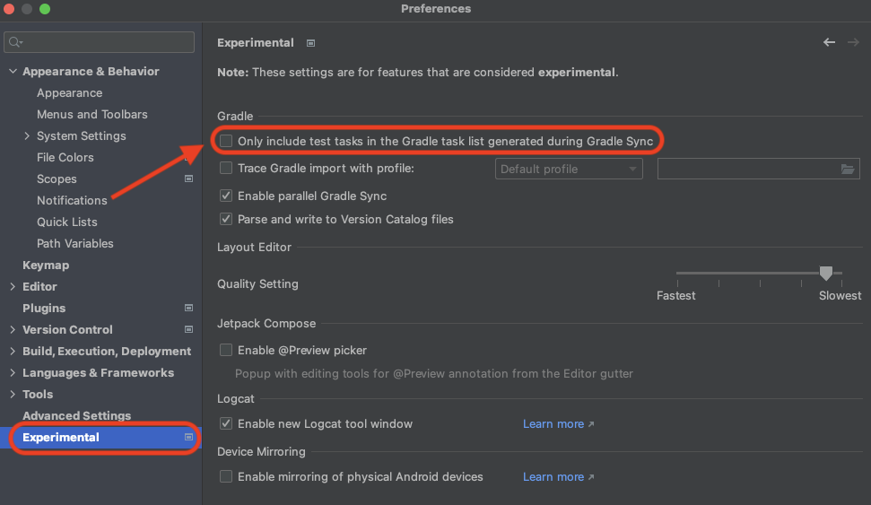
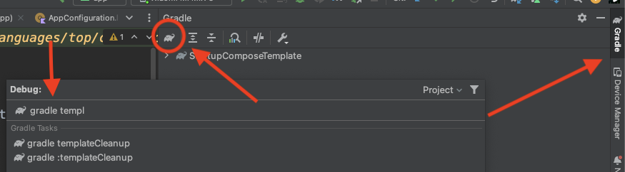

# kotlin-android-template 🤖

A simple Github template that lets you create an **Android/Kotlin** project and be up and running in a **few seconds**.

## How to use 👣

Just click on  button to create a new repo starting from this template.
Steps to run:
- Clone the new project.
- On Android Studio: Settings -> Experimental -> remove the flag "Only include test tasks in the Gradle task list generated during Gradle Sync".
    

    
    

- Reload the Gradle project by clicking on File -> "Sync Project with gradle Files" icon and the tasks will appear.
- Rename "project" and "packageName" in [cleanup.gradle.kts](buildSrc/src/main/kotlin/cleanup.gradle.kts).
- Cleanup and Rebuild project.
- Run "template-cleanup" gradle script: Gradle -> Execute Gradle Task -> type "template-cleanup" after gradle.
    

    
    

- Reload the Gradle project by clicking on File -> "Sync Project with gradle Files"
- Build and run the project.

## TODO 🔨

- <s>Add [name] in [cleanup.gradle.kts](buildSrc/src/main/kotlin/cleanup.gradle.kts).</s>
- <s>Renaming [TemplateApp], [TemplateTheme] and [AppConfiguration, application_name] with [name] in [cleanup.gradle.kts](buildSrc/src/main/kotlin/cleanup.gradle.kts).</s>
- Renaming [Theme.StartupComposeTemplate] in [manifest](app/src/main/AndroidManifest.xml) and in [themes](app/src/main/res/values/themes.xml).
- Add version template.
- Populate readme documentation.

## Features 🎨

- **100% Kotlin-only template**.
- Jetpack Compose setup ready to use.
- 100% Gradle Kotlin DSL setup.
- Dependency versions managed via `buildSrc`.

## Gradle Setup 🐘

This template is using [**Gradle Kotlin DSL**](https://docs.gradle.org/current/userguide/kotlin_dsl.html) as well as the [Plugin DSL](https://docs.gradle.org/current/userguide/plugins.html#sec:plugins_block) to setup the build.

## Contributing 🤝

Feel free to open a issue or submit a pull request for any bugs/improvements.